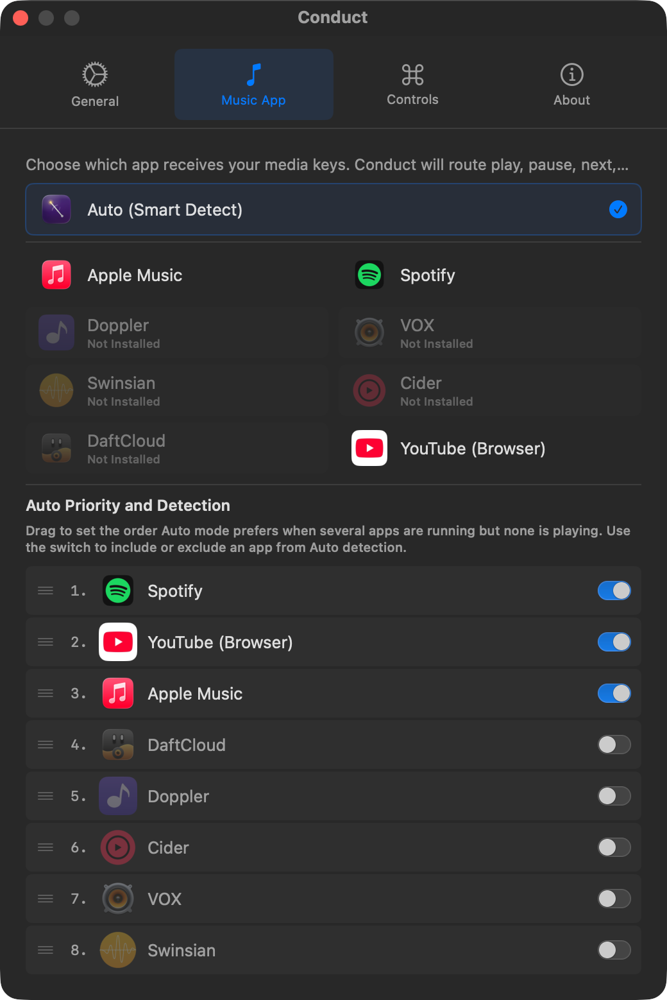
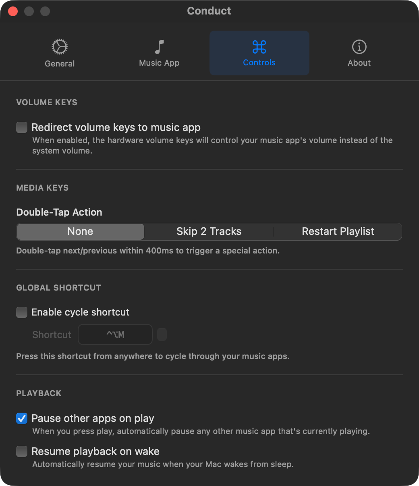
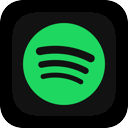
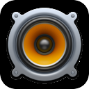
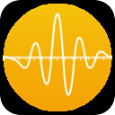
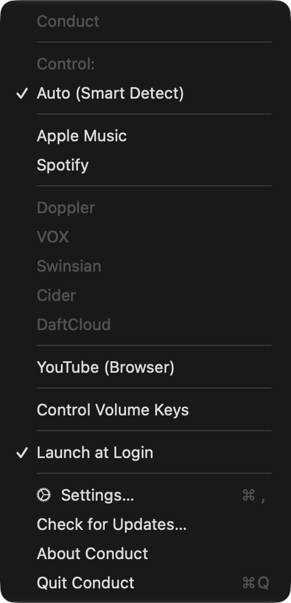

# Conduct

<p align="center">
  
</p>

> _Every orchestra needs a conductor. **Conduct** swings its baton so your media keys always hit the right note - no matter what's in the foreground._

A free, open-source macOS menu bar utility that takes full control of your media keys and directs them to the music app of your choice.

**macOS 11.0+** · **Swift 5.9** · **MIT License**

<p align="center">
  <a href="https://github.com/sponsors/kxdrsrt"></a>
  <a href="https://ko-fi.com/kadirsert"></a>
  <a href="https://opencollective.com/kxdrsrt"></a>
  <a href="https://www.patreon.com/cw/kxdrsrt"></a>
  <a href="https://liberapay.com/kxdrsrt/"></a>
</p>

---

<p align="center">
  
  &nbsp;
  
</p>

---

## Features

<table>
  <tr>
    <td valign="top" width="50%">&nbsp;<strong>Auto Mode</strong><br>Intelligently detects which music app is currently playing and routes keys there automatically</td>
    <td valign="top" width="50%">&nbsp;<strong>YouTube Browser Control</strong><br>Controls YouTube playback in Safari, Chrome, Arc, Brave, Edge, Vivaldi, Opera, Orion, Dia, Zen, Waterfox, and Chromium</td>
  </tr>
  <tr>
    <td valign="top" width="50%">&nbsp;<strong>Universal Media Key Routing</strong><br>Play/pause, next, and previous always go where you want</td>
    <td valign="top" width="50%">&nbsp;<strong>Volume Key Hijacking</strong><br>Optionally redirect hardware volume keys to control your music app's volume instead of system audio</td>
  </tr>
  <tr>
    <td valign="top" width="50%">&nbsp;<strong>9 Supported Players</strong><br>From Apple Music and Spotify to niche players like Swinsian and DaftCloud</td>
    <td valign="top" width="50%">&nbsp;<strong>Invisible &amp; Lightweight</strong><br>Lives in your menu bar as a tiny baton icon (<picture><source media="(prefers-color-scheme: dark)" srcset="Resources/MenuBarIcon-light@2x.png"></picture>), uses near-zero resources</td>
  </tr>
  <tr>
    <td valign="top" width="50%">&nbsp;<strong>Launch at Login</strong><br>Set it and forget it</td>
    <td valign="top" width="50%">&nbsp;<strong>Fully Open Source</strong><br>MIT licensed, no telemetry, no ads</td>
  </tr>
</table>

---

## Why?

macOS sends media key events to whatever app is "foremost" or was last active. This means if you're listening to Spotify and click a YouTube link, pressing play/pause will control the video instead of your music.

**Conduct** fixes this by intercepting media keys at the system level and always routing them to your chosen app - or in Auto mode, to whichever player is actually making sound.

---

## Supported Apps

### Official Players

| App                                                                                   | Description                                     |
| ------------------------------------------------------------------------------------- | ----------------------------------------------- |
|  **Apple Music** | macOS built-in music player (formerly iTunes)   |
|  **Spotify**         | Popular streaming service with native macOS app |

### Third-Party Players

| App                                                                               | Description                                                                               |
| --------------------------------------------------------------------------------- | ----------------------------------------------------------------------------------------- |
|  **Doppler**     | Premium local music player for audiophiles - plays FLAC, ALAC, and other lossless formats |
|  **VOX**             | Lightweight player focused on hi-res audio and SoundCloud streaming                       |
|  **Swinsian**   | Advanced music player with wide format support and folder-based library management        |
|  **Cider**         | Open-source Apple Music client with custom UI and community plugins                       |
|  **DaftCloud** | Native SoundCloud client for macOS - stream and control SoundCloud from a dedicated app   |

### Browser-Based

| App                                                                           | Description                                                                             |
| ----------------------------------------------------------------------------- | --------------------------------------------------------------------------------------- |
|  **YouTube** | Controls YouTube/YouTube Music playback in any supported browser via keyboard shortcuts |

> **Supported Browsers:** Safari, Google Chrome, Arc, Brave, Microsoft Edge, Vivaldi, Opera, Orion (Kagi), Dia, Zen Browser, Waterfox, Chromium
>
> If your browser isn't listed here, please [open a GitHub issue](https://github.com/kxdrsrt/conduct-app/issues) and we'll add support for it.

---

## Menu Bar

**Conduct** lives in your menu bar. Click the baton icon (<picture><source media="(prefers-color-scheme: dark)" srcset="Resources/MenuBarIcon-light@2x.png"></picture>) to access all controls:

<p align="center">
  
</p>

| Option                  | Description                                                                                       |
| ----------------------- | ------------------------------------------------------------------------------------------------- |
| **Control**             | Choose which app receives media key events. **Auto** detects the active player automatically.     |
| **Control Volume Keys** | When enabled, volume up/down/mute keys control the selected app's volume instead of system audio. |
| **Launch at Login**     | Start **Conduct** automatically when you log in.                                                  |

---

## How It Works

**Conduct** creates a [CGEvent tap](https://developer.apple.com/documentation/coregraphics/cgevent) that intercepts system-defined events (media key presses). When a media key is detected, **Conduct** consumes the event (preventing it from reaching other apps) and sends the corresponding command to your selected music app via AppleScript.

### Auto Mode

When set to **Auto (Smart Detect)**, **Conduct** uses a priority-based algorithm:

1. Checks which music apps are currently running
2. Queries each app's player state to find which one is actively playing
3. Falls back to the most recently launched music app
4. Falls back to the first available running music app

This means you can switch between Spotify and Apple Music naturally - **Conduct** will always route to whichever one is actually playing.

### YouTube Support

YouTube control works by detecting YouTube tabs across all supported browsers and sending YouTube's native keyboard shortcuts (e.g. `K` for play/pause, `Shift+N` for next). **Conduct** briefly activates the browser window, sends the keystroke, and restores focus - all within ~200ms.

> [!NOTE]
> **All browsers** work out of the box - no extra configuration or JavaScript permissions needed.
>
> **Firefox-based browsers** (Firefox, Zen, Waterfox) are detected via window title since they don't expose tab URLs to AppleScript.

---

## Installation

### Download

Download the latest release from the [Releases](https://github.com/kxdrsrt/conduct-app/releases) page.

### Build from Source

```bash
# Simple build (native architecture)
make build

# Universal binary (Intel + Apple Silicon)
make build-universal

# Build and run
make run

# Install to /Applications
make install
```

### Using Xcode

```bash
# Generate Xcode project (requires xcodegen)
brew install xcodegen
make generate-project
open Conduct.xcodeproj
```

---

## Permissions

On first launch, **Conduct** will request:

1. **Accessibility** - Required to intercept media key events at the system level. Go to System Settings > Privacy & Security > Accessibility and enable **Conduct**.

2. **Automation** - Required to send play/pause/next/previous commands to your music app. You'll be prompted when the first command is sent.

---

## Requirements

- macOS 11.0 (Big Sur) or later
- Accessibility permission (to intercept key events)
- Automation permission (to control music apps)

---

## Contributing

Contributions are welcome! Please feel free to submit a Pull Request.

## License

MIT License - see [LICENSE](LICENSE) for details.

## Credits

Inspired by [Reflex](https://stuntsoftware.com/reflex/) by Stunt Software.

---

<p align="center">
  <a href="https://github.com/sponsors/kxdrsrt"></a>
  <a href="https://ko-fi.com/kadirsert"></a>
  <a href="https://opencollective.com/kxdrsrt"></a>
  <a href="https://www.patreon.com/cw/kxdrsrt"></a>
  <a href="https://liberapay.com/kxdrsrt/"></a>
</p>
